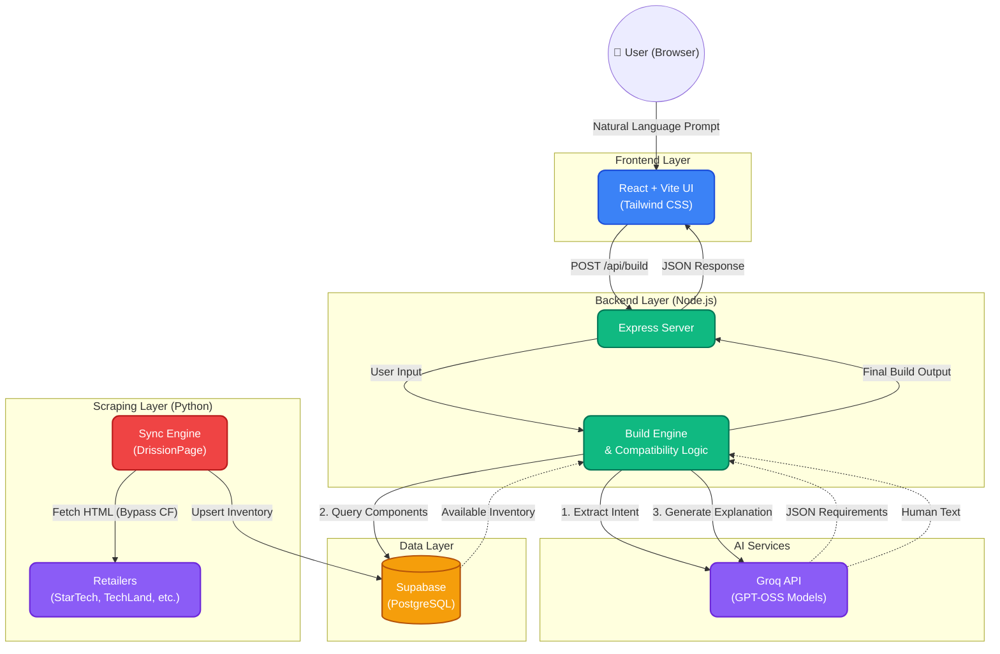

# BuildMyPC 🇧🇩
### AI-Powered PC Configurator for the Bangladeshi Market

BuildMyPC turns a plain-language prompt into a fully compatible, budget-optimised PC build using live inventory from Bangladesh's top retailers. No spreadsheets, no guesswork — just type what you need.

> *"Gaming PC, 80k budget, AMD, no GPU, include monitor"* → Full compatible build in seconds.

**Live Demo**
- Frontend (Vercel): `https://your-frontend-url.vercel.app`
- Backend (Render): `https://your-backend-url.onrender.com`

---

## Table of Contents

- [How It Works](#how-it-works)
- [Features](#features)
- [Tech Stack](#tech-stack)
- [Local Setup](#local-setup)
- [Deployment](#deployment)
- [Project Structure](#project-structure)

---

## How It Works

BuildMyPC uses a five-phase **Dynamic Blueprint Architecture** that replaces static budget ratios with AI-driven, per-build decision making.

```
User Prompt
    │
    ▼
┌─────────────────────────────────────────┐
│  Phase 0 — Intent Extraction            │
│  Groq (GPT-OSS-120B / GPT-OSS-20B)      │
│  Parses budget, use case, constraints   │
│  Outputs a weighted component blueprint │
└──────────────────┬──────────────────────┘
                   │
                   ▼
┌─────────────────────────────────────────┐
│  Phase 1 — Pre-Flight Floor Check       │
│  Queries Supabase for the cheapest      │
│  part that satisfies each constraint.   │
│  Fails fast if budget is impossible.    │
└──────────────────┬──────────────────────┘
                   │
                   ▼
┌─────────────────────────────────────────┐
│  Phase 2 — Weighted Budget Allocation   │
│  Surplus above floor is distributed     │
│  proportionally by AI-assigned weights. │
│  (e.g. GPU gets more budget for gaming) │
└──────────────────┬──────────────────────┘
                   │
                   ▼
┌─────────────────────────────────────────┐
│  Phase 3 — Component Selection          │
│  Picks best part per category within    │
│  each dynamic budget cap, enforcing:    │
│  · CPU socket ↔ Motherboard match       │
│  · DDR4 / DDR5 generation match         │
│  · PSU wattage = (CPU+GPU TDP) × 1.4   │
│  · iGPU enforcement for no-GPU builds   │
└──────────────────┬──────────────────────┘
                   │
                   ▼
┌─────────────────────────────────────────┐
│  Phase 4 — Iterative Rebalancing        │
│  Spends remaining surplus by upgrading  │
│  components in AI weight order until    │
│  budget is fully utilised.              │
└──────────────────┬──────────────────────┘
                   │
                   ▼
          Full Build + Warnings + Explanation
```

### System Architecture & Data Flow

To support this dynamic build engine, the platform is divided into three key layers: **Data Ingestion (Scraping)**, **Intent & Planning (AI Engine)**, and **Build Orchestration**:



#### 1. Data Ingestion (The Scraper Layer)
*   **The Python Scraper** (`sync_db.py`) runs as a background process to harvest fresh component data.
*   It crawls the inventory of major Bangladeshi retailers: **StarTech**, **TechLand**, and **ComputerMania**.
*   Using **DrissionPage** (and native Chrome DevTools Protocol control), it easily bypasses strict anti-bot protections and Cloudflare JS challenges.
*   Product technical specifications (socket types, DDR support, speeds, estimated TDP wattage) are programmatically inferred from titles and specs.
*   The raw results are bulk-upserted directly to **Supabase (PostgreSQL)**, automatically refreshing stock levels and current prices.

#### 2. User Intent & Planning (The AI Engine)
*   When a user submits a search (e.g., *"I want a gaming setup for 75,000 taka, prefer AMD"*), the **React Frontend** POSTs the request to the **Node.js Express Backend**.
*   The backend delegates the prompt to the primary **Groq API** (`openai/gpt-oss-120b`), which serves as our intent extractor.
*   The LLM translates the query into a structured, typed JSON schema containing exact budget bounds, specific requested categories, and hard component requirements.

#### 3. Build Orchestration & Response
*   The backend's **Build Orchestrator** takes the structured JSON requirements and executes the planning and filtering cycles.
*   It runs a series of strict **Compatibility Checkers** that query the Supabase database for real in-stock options:
    *   *Socket matching*: CPU socket type strictly matched to motherboards.
    *   *Generation matching*: DDR4 vs. DDR5 memory generation checked across CPU, board, and memory sticks.
    *   *TDP constraints*: PSU wattage computed as CPU TDP + GPU TDP multiplied by safety headroom parameters.
*   Once a fully verified build is constructed, a secondary Groq LLM (`openai/gpt-oss-20b`) generates a natural, simple, and neutral compatibility justification explaining exactly why these components are compatible and perfect for the user's budget.
*   The payload (components, pricing, and justification text) is served back to the React UI for an interactive display.

---

## Features

**AI & Build Engine**
- **Modular Dependency Injection Architecture** for clean, testable logic and rapid testing.
- **Natural Language Prompts** in English or Bangla numerals (e.g., `৬৫ হাজার`, `65k BDT`).
- **Conversational Follow-Up & Refinements**: Tweak builds iteratively (e.g., *"Upgrade RAM to 32GB"*) without starting over. The LLM compares previous vs. new intent, performing JSON diffing, and **locks unchanged categories** to preserve choices and save API resources.
- **AI Resilience**: `RotatingGroqClient` automatically cycles through multiple API keys to prevent 429 rate limit downtime.
- **Keyword Degradation Safety Net**: Relaxes constraints progressively if no exact match is found.
- **Spec-Based Fallback**: Dynamically infers RAM type requirements based on motherboard socket (LGA1200/AM4) even when keywords are missing.
- **CPU/GPU Bottleneck Prevention**: `isCpuBalanced` safety check.
- **Integrated GPU Detection**: Handled automatically for builds without discrete graphics cards.

**Hardware Compatibility**
- **Socket Chain validation**: CPU ↔ Motherboard ↔ RAM ↔ PSU.
- **DDR4/DDR5 Generations**: Enforced across CPU, Motherboard, and RAM simultaneously.
- **Ambiguity Rejection**: LGA1700 boards with ambiguous DDR type are rejected when a generation is specified.
- **PSU Power Floor**: Scales dynamically with actual CPU and GPU TDP estimates (`(CPU_TDP + GPU_TDP) * 1.4 + overhead`).

**Inventory & Data**
- **Multi-Retailer ETL Scraper**: Fetches live parts from StarTech, TechLand, and ComputerMania.
- **Bypassing Cloudflare**: Bypasses strict anti-bot protections on ComputerMania using `DrissionPage` (controls real browser via Chrome DevTools Protocol off-screen).
- **Intelligent Caching**: 30-minute in-memory cache with active TTL eviction and stampede protection (deduplicates concurrent identical queries).

**Security, Reliability & Scale**
- **High-Concurrency Queue System**: Supports 50-100+ concurrent builds on free tiers. Converts requests into async jobs instantly, polling every 3 seconds while showing queue position and estimated wait times.
- **Traffic Safety Valve**: High-traffic warning banner active when queue > 3 prompts users to input their own Groq key, dynamically bypassing shared rate limits.
- **Self-Healing Keep-Alive**: Active external cron (cron-job.org) pings `/health` every 10 min, keeping backend container active and pre-warming the Supabase PostgreSQL connection pool.
- **Request Cancellation**: Aborting a build on the UI instantly stops the AI and database search process to conserve hosting resources.
- **Rate limiting & Sanitisation**: 10 builds per 15 mins per IP, 2,000-character prompts, and API key length validation.
- **Post-Build Validation**: Restored 6 warning types (storage capacity, PSU wattage, GPU adequacy, DDR sync, motherboard socket) displayed directly to the user.

---

## Tech Stack

| Layer | Technology |
|---|---|
| Frontend | React 19, Vite 6, Tailwind CSS 4 |
| Backend | Node.js, Express 4 |
| Database | Supabase (PostgreSQL) |
| AI — Primary | Groq (GPT-OSS-120B) |
| AI — Fallback | Groq (GPT-OSS-20B) |
| Scraper | Python, DrissionPage, BeautifulSoup4, Requests |
| Frontend Hosting | Vercel |
| Backend Hosting | Render (Singapore) |

---

## Local Setup

### Prerequisites

- Node.js 18+
- Python 3.10+ (for the scraper)
- A [Supabase](https://supabase.com) project with the `components` table created
- A [Groq](https://console.groq.com) API key

---

### 1. Clone & Install

```bash
git clone https://github.com/sheikhhossainn/pcbuilding-agent.git
cd pcbuilding-agent

# Install backend dependencies
npm install

# Install frontend dependencies
cd frontend && npm install && cd ..
```

---

### 2. Configure Environment

Create `backend/.env`:

```env
# AI Providers (At least one Groq key required for GPT-OSS-120B)
GROQ_API_KEY=your_primary_groq_key
GROQ_API_KEY_2=your_fallback_groq_key  # Optional: For automatic 429 rate-limit rotation

# Supabase
SUPABASE_URL=https://your-project-id.supabase.co
SUPABASE_SERVICE_ROLE_KEY=your_service_role_key

# Optional
PORT=3001
```

Create `scraper/.env` (same Supabase credentials):

```env
SUPABASE_URL=https://your-project-id.supabase.co
SUPABASE_SERVICE_ROLE_KEY=your_service_role_key
```

---

### 3. Populate the Database

The app needs product data before it can build anything. Run the scraper once to seed Supabase:

```bash
cd scraper

# Create and activate virtual environment
python -m venv venv

# Windows
./venv/Scripts/activate
# macOS / Linux
source venv/bin/activate

# Install dependencies
pip install -r requirements.txt

# Run the ETL sync (scrapes StarTech → TechLand → ComputerMania)
python sync_db.py
```

The scraper is fault-tolerant — it checkpoints after each category and resumes from the exact failure point on restart. A full sync takes roughly 15–30 minutes depending on inventory size.

---

### 4. Run Locally

From the project root:

```bash
npm run start:all
```

| Service | URL |
|---|---|
| Frontend | http://localhost:5173 |
| Backend API | http://localhost:3001 |

---

## Deployment

### Backend → Render

1. Create a **New Web Service** and connect your GitHub repository.
2. Set the following:

| Field | Value |
|---|---|
| Root Directory | *(leave blank)* |
| Build Command | `npm install` |
| Start Command | `npm run start:backend` |
| Region | Singapore (closest to BD) |

3. Add all keys from `backend/.env` under **Environment Variables**.
4. Render automatically injects `PORT` — no need to set it manually.

---

### Frontend → Vercel

1. Create a **New Project** and connect your GitHub repository.
2. Set the following:

| Field | Value |
|---|---|
| Root Directory | `frontend` |
| Framework Preset | Vite |
| Build Command | `npm run build` |

3. Add this environment variable:

| Key | Value |
|---|---|
| `VITE_BACKEND_URL` | Your Render service URL, e.g. `https://buildmypc-api.onrender.com` |

---

## Project Structure

```
pcbuilding-agent/
├── frontend/
│   └── src/
│       ├── components/
│       │   └── Builder.jsx        # Main UI — prompt input, build results
│       ├── App.jsx
│       └── vite.config.js         # Proxies /api/* → :3001 in dev
│
├── backend/
│   ├── ai/                        # LLM Intent Extraction & Explanation (Rotating API keys)
│   ├── engine/                    # Budget Allocation, Part Selection, Compatibility, & buildOrchestrator.js
│   ├── config/                    # Global constraints, tdp heuristics, & budgets
│   ├── utils/                     # Supabase Repos, cacheManager.js, queueManager.js & specInference.js
│   ├── routes/                    # API route handlers (POST submit, GET status poll)
│   ├── server.js                  # Express setup and dependency injection bootstrap
│   └── .env                       # API keys (not committed)
│
├── scraper/
│   ├── sync_db.py                 # ETL daemon — scrapes and upserts to Supabase
│   ├── sync_state.json            # Checkpoint file for fault recovery
│   └── scrapers/
│       ├── startech.py
│       ├── techland.py
│       ├── computermania.py
│       └── generic.py
│
└── package.json                   # Root — runs frontend + backend concurrently
```

---

## Supported Retailers & Categories

| Category | StarTech | TechLand | ComputerMania |
|---|:---:|:---:|:---:|
| CPU | ✅ | ✅ | ✅ |
| Motherboard | ✅ | ✅ | ✅ |
| RAM | ✅ | ✅ | ✅ |
| Storage (SSD) | ✅ | ✅ | ✅ |
| GPU | ✅ | ✅ | ✅ |
| PSU | ✅ | ✅ | ✅ |
| Casing | ✅ | ✅ | ✅ |
| CPU Cooler | ✅ | ✅ | ✅ |
| Monitor | ✅ | ✅ | ✅ |
| Mouse | ✅ | ✅ | ✅ |
| Keyboard | ✅ | ✅ | ✅ |

---

## License

MIT License — Created by [Sheikh Hossain](https://github.com/sheikhhossainn)