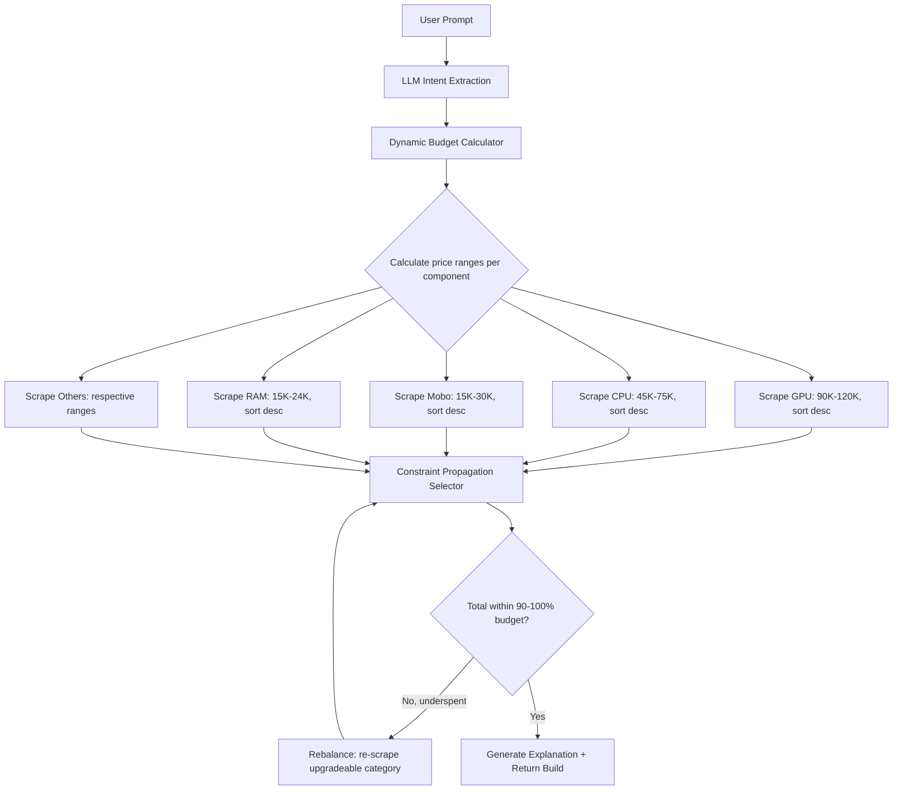

# Smart Budget-Aware Scraping & Constraint-Based Component Selection

The current system scrapes up to 25 pages per category (blindly), uses fixed % budget allocations (e.g. 35% GPU), then does a messy two-pass upgrade loop. This plan replaces it with a smarter architecture:

1. **Scraper** accepts price range + sort order → fetches only 2-3 relevant pages instead of 25
2. **Backend** calculates dynamic budget ranges per component, then uses constraint-propagation to select the best build

## Current Problems

| Issue | Cause |
|---|---|
| First build takes 60+ seconds | Scraping 25 pages × 11 categories = ~275 HTTP requests |
| 1600W PSU, 4TB SSD overkill | Fixed % allocations + greedy "most expensive" upgrade pass |
| Ryzen 5 on a 300K build | GPU eats all the budget before CPU gets upgraded |
| Wrong monitor (60Hz ProArt) | No price-targeted or spec-targeted scraping |

---

## Proposed Changes

### 1. Scraper Service (`scraper/`)

#### [MODIFY] `scraper/main.py`
- Add **new query params** to the `/scrape` endpoint:
  - `price_min` (int, optional) — minimum price filter
  - `price_max` (int, optional) — maximum price filter  
  - `sort` — `price_asc` or `price_desc` (default: none)
- Pass these down to site-specific scrapers
- Keep the 30-min cache (cache key includes price range + sort)

#### [MODIFY] `scraper/scrapers/startech.py`
- Accept `price_min`, `price_max`, `sort_order` params in `scrape()`
- Build URL with StarTech's native query params:
  - `?sort=p.price&order=DESC` for high→low
  - `?sort=p.price&order=ASC` for low→high
  - `?filter_min_price=X&filter_max_price=Y` for price ranges
- **Reduce `MAX_PAGES` back to 3** — with price filtering, 3 pages (~60 products) per category is more than enough
- This alone cuts scraping from ~275 requests to ~33 (3 pages × 11 categories)

#### [MODIFY] `scraper/scrapers/techland.py`
- Same params as startech
- TechLand uses `?sort=p.price&order=DESC` for sorting (same OpenCart engine)
- Investigate and implement their price filter param (likely `&fmin=X&fmax=Y` or `&filter_min_price=X`)
- Reduce `MAX_PAGES` to 3

---

### 2. Backend (`backend/server.js`)

#### [MODIFY] `backend/server.js` — Dynamic Budget Engine

**Replace the fixed % allocation system** with a dynamic budget calculator:

```
function calculateBudgetRanges(budget, intent) {
  // Base ratios vary by use_case AND tier
  // Example for gaming high-end (300K):
  //   GPU: 30-40% → 90K-120K
  //   CPU: 15-25% → 45K-75K  
  //   Mobo: 5-10% → 15K-30K
  //   RAM: 5-8%  → 15K-24K
  //   Storage: 3-7% → 9K-21K
  //   PSU: 2-4% → 6K-12K (cheapest adequate)
  //   Casing: 1-3% → 3K-9K
  //   Cooler: 1-3% → 3K-9K
  //   Monitor: 5-10% → 15K-30K
  //   Mouse: 0.5-1.5% → 1.5K-4.5K
  //   Keyboard: 0.5-1.5% → 1.5K-4.5K
  
  // Returns { category: { min, max, priority } }
}
```

The ranges are **min/max bands**, not fixed points. The selection engine uses them as price filters for the scraper AND as constraints during selection.

**Replace the selection logic** with constraint-propagation:

```
Step 1: ANCHOR — Pick the primary component first
  - Gaming → GPU is anchor (gets biggest budget band)
  - Office → CPU is anchor
  - Call scraper with price_min/max for this component
  - Select the best match (respecting brand preference)

Step 2: CHAIN — Pick dependent components
  - GPU selected → CPU must be balanced (no i3 with RTX 4080)
  - CPU selected → Motherboard must match socket
  - Motherboard selected → RAM must match DDR type
  - GPU+CPU TDP → PSU wattage requirement (pick cheapest adequate)

Step 3: FILL — Pick remaining components
  - Storage, Casing, Cooler, Peripherals
  - Use remaining budget, not fixed %

Step 4: REBALANCE — If total < 90% of budget
  - Identify the component with the biggest "upgrade gap"
  - Re-scrape that one category with a higher price range
  - Swap in the upgrade
  - Repeat until within 90-100% of budget
```

The key difference from today:
- **Today**: scrape everything → filter locally → upgrade loop
- **New**: calculate price ranges → scrape only what's relevant → select in dependency order → rebalance if underspent

> [!IMPORTANT]
> **This does NOT change the intent extraction, compatibility engine, or UI.** Only the scraper params and the selection/allocation logic change.

---

## Architecture Diagram



---

## Open Questions

> [!WARNING]
> **TechLand price filter params** — I confirmed sorting works (`?sort=p.price&order=DESC`), but I haven't verified TechLand's exact price range filter params yet. I'll test this during implementation and fall back to sort-only + local filtering if their price filter doesn't work via URL.

> [!IMPORTANT]
> **Rebalance loop limit** — The rebalance step could theoretically loop forever. I'll cap it at **3 iterations** max. If after 3 rebalances the total is still under 80% of budget, we return the build as-is with a note.

> [!NOTE]
> **Cache strategy** — With price-range-specific scraping, cache keys become more granular (e.g. `startech:gpu:50000-150000:desc`). This means more cache entries but each one is smaller and more targeted. The 30-min TTL stays the same.

---

## Performance Comparison

| Metric | Current | Proposed |
|---|---|---|
| HTTP requests per build | ~275 (25 pages × 11 categories) | ~33 (3 pages × 11 categories) |
| First build time | 60-90 seconds | ~10-15 seconds |
| Cached build time | ~2 seconds | ~2 seconds |
| Selection accuracy | Fixed %, needs upgrade passes | Dynamic ranges, constraint-based |

---

## Verification Plan

### Automated Tests
- Test the same prompt ("300K gaming PC, NVIDIA RTX, 32GB DDR5, Ryzen, 240Hz monitor") before and after
- Verify: total within 90-100% of budget, GPU is NVIDIA, RAM is 32GB DDR5, monitor has 240Hz in name
- Time the request to confirm speed improvement

### Manual Verification
- Try budget builds (30K office PC) and high-end builds (300K gaming) to confirm dynamic ranges adapt correctly
- Check that the PSU is always the cheapest adequate option, not the most expensive
